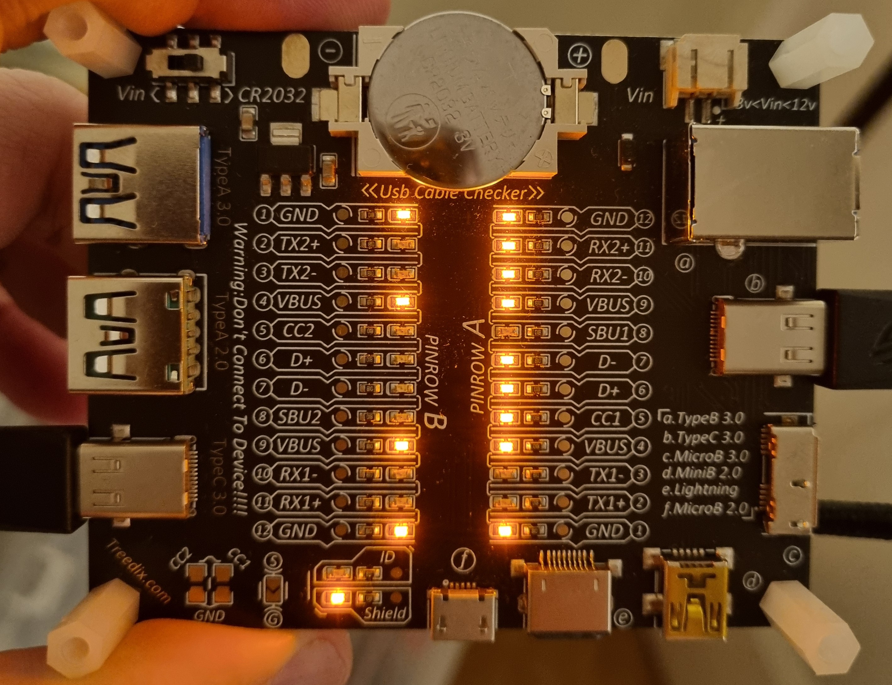

# ASUS ROG Falcata

I bought this keyboard in december 2025 and have almost exclusively used in 
Linux, though with some issues. I have mostly been using the keyboard on PCs
running CachyOS so far and my experience migth be limited. 

I mainly use this keyboard for coding and productivity and not so much gaming. 
Yes it's expensive but I'm quite picky with my keyboards and I could have found
cheaper, even more custom, ones. I didn't want to spend loads of money on a 
completely custom one that I couldn't return.

My previous favourite, that was good enough, was Microsofts Natural Keyboard
but mine is staring to break down and they are getting harder and harder to 
get new ones since they stoped making them.

## Link cable

The two halves of the keyboard is connected with what looks like an USB-C
cable but according to ASUS and various people on the interwebs it's a 
custom pinout. The connectors are USB-C but thats it.

I'v plugged my cable into a cheap USB Cable checker and I got this image 
that might help someone. I thought it could help someone. I will try to
beep out the true connection at some time.

## Firmware

Delivered with `8.00.01` but I had some issues getting configuration changes to
stick so I upgraded to `8.00.19` and after that it works.

## Linux experience

Out of the box, the keyboard works but changing settings were impossible.
Chrome, Chromium and Opera all found the keyboard using 
https://gearlink.asus.com but there were issues as soon as I tried to get
any further. And yes, it's access related.

The quick and dirty way of enabling access is to run 
`sudo chmod a+rw /dev/hidraw*` before trying to access the keyboard using
the web application. A more permanent solution is to create udev rules.

### Stuff that I haven't got to work

I have not been able to find a way to do firmware updates using Linux
but it worked without any issues in Windows 11.
